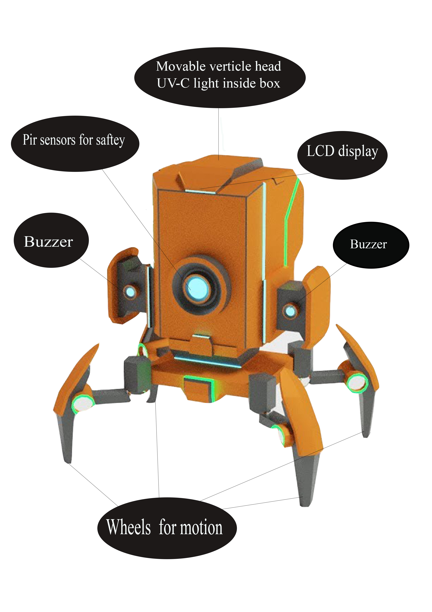

# Yuvraj-kadale

## Hack_Against_Covid

### || A Part Of Mission Against Coronavirus ||

# Problem Statement:
Transmission of SARS-CoV–2, the beta coronavirus causing COVID–19, is through direct contact and airborne routes, and studies of SARS-CoV–2 stability have shown viability in aerosols for at least 3 hours. Given the rapid spread of the disease, including through asymptomatic carriers, it is of evident importance to explore practical mitigation technologies that can inactivate the airborne virus in public locations and thus limit airborne transmission and surface contact transmission. Observing the present scenario of India, the rate of spread of Coronavirus is exponential and has to be stopped.

# Solution:
Ultraviolet (UV) light exposure is a direct antimicrobial approach, and its effectiveness against different strains of airborne viruses has long been established. Here we propose a cost-effective IoT based robot that can sanitize the mass area using UV-C lights within 15 minutes. The most commonly employed type of UV-C light for germicidal applications is a low-pressure mercury-vapour arc lamp, emitting around 254 nm; When the light of 254nm is shined on bacteria, viruses, and other pathogens, it deactivates their DNA, destroying their ability to multiply and killing them. The bot has embedded the Arduino board integrated with PIR sensors to detect the Human presence and sanitize automatically in the absence of humans.

# How is the project unique?
The proposed product is a chemical less, eco-friendly mass sanitization system, which supports the latest guidelines given by the government concerning the mass sanitization of public places. The Robot Quickly disinfects bacteria, viruses, and fungi on hard to reach surfaces and produce NO Ozone. The optimal germicidal wavelength of 254 nm is used that takes care of future/upcoming challenges, hence the name "Bhavishy". Not only Coronavirus, but it will also kill other germs and other contagious microorganisms. The extension of the product can be further implemented for eco-friendly, chemical less water disinfection, during this high times of covid.

### How is your proposed product/ process/service being different/ better from a similar product/ process/ service, if any, in the market?
The present system is not affordable by the middle-class individuals, and the exposure of human skin to UV-C light for an extended period may result in skin cancer. Here we introduce a cost-effective, low-cost mass sanitization robot, whose GUI makes it friendly to use, and it keeps human safety as its priority.

### This is a technology based hardware project! what is its TRL level and features? 
At present, I have achieved TRL-6; the features of the system include Four wheels at the base, making it easy to move around. For safety measures while moving from one place to another, the vertically movable head contains UV-C lights inside. Three verticle UV-C lights placed such that each is covering an angle of 120 degrees and sanitizing complete 360 degrees at a single point of time. Buzzer and LCD system to display the device state with a user-friendly GUI. Force autostop of the system in case of emergency or contact with IR radiating object.

# Is it feasible?
### Lets make it SMART
#### Specific -
<ul>•	Four wheels at the base.</ul> 
<ul>•	A vertically movable head.</ul> 
<ul>•	Three verticle UV-C lights each covering 120 degree.</ul> 
<ul>•	Buzzer and LCD system to display the device state.</ul> 
<ul>•	Emergency stop.</ul>
<ul>•	Switch on and switch off timings can be altered manually.</ul>

#### Measurable-
Code and simulation are achieved on proteus software, which gave a positive output. For the preparation of the model, we have reached out to a few vendors and suppliers. As soon as I receive the required material, the product will be ready to launch by the end of September.  
#### Atainable-
The required model will be 3D printed, the simulation is done on blender software.The codes and the microcontrollers is positivly simulated on Proteus software.Starting with my campus, I will be expanding this product to schools, colleges, and hospitals.
#### Realistic-
Sound knowledge in Arduino programming and 3D modeling is sufficient.
#### Timeline-
At present, TRL-6 has is achieved. As soon as I get the required materials, the TRL-7 will be produced. By the middle of September, I will be ready to implement it in my campus. And the product will be ready to launched by the end of September.
